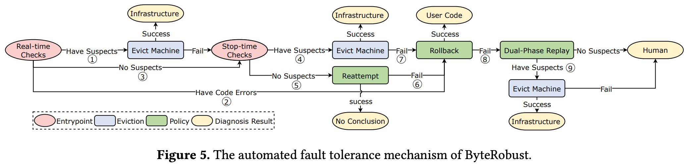
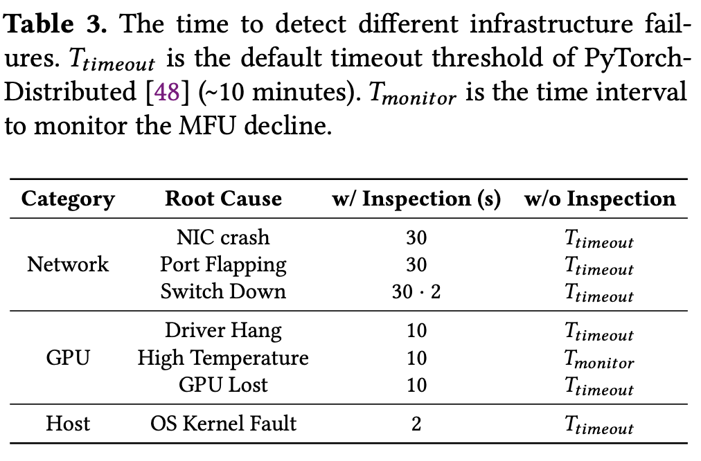
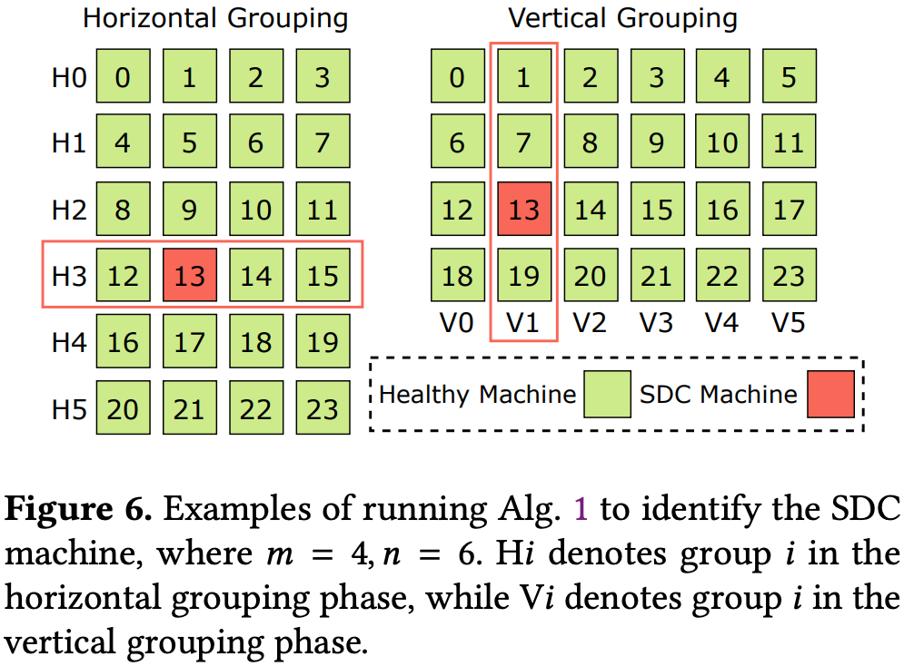
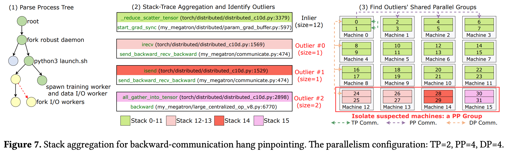
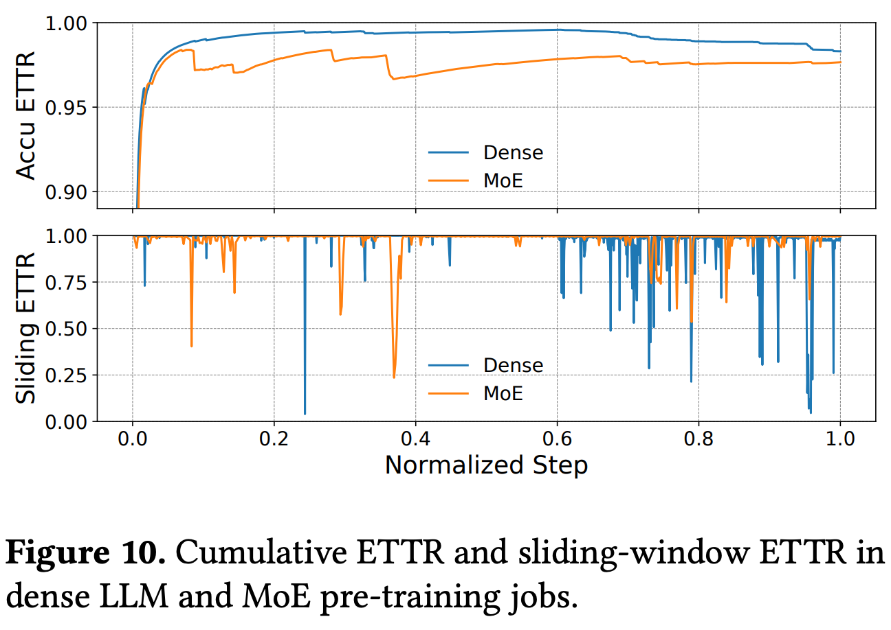
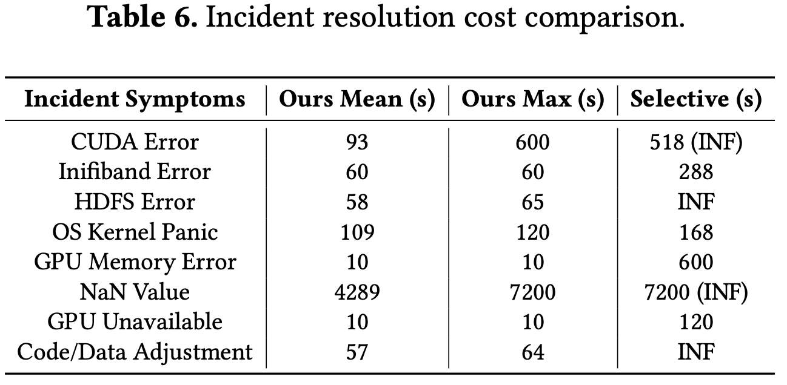

今年 10 月，字节跳动联合香港大学在 ACM 操作系统顶会 SOSP 发布了论文 Robust LLM Training Infrastructure at ByteDance，系统名为 ByteRobust。这套系统已经在字节的生产级GPU平台上部署了一年多，覆盖20万张GPU的集群，在一次持续 3个月、使用 9600 张 H100 GPU的大模型预训练任务中，实现了97% 的有效训练时间比率(ETTR)，刷新业界SOTA。

本文尝试对ByteRobust做一次工程视角的技术解读，并提出以下几个观点：

当前预估将ByteRobust扩展到10W卡级别，可以达到70%的ETTR
当系统具备微秒级别的快恢能力，单硬件组件的平均无故障时间（MTBF）将不再是瓶颈。云上弹性系统能力可以补充硬件可靠性的不足，从而减少AI集群的TCO。
在训练系统扩展到10万卡规模时，静默数据错误（SDC）风险将成为主要矛盾，AI Infra将从有效训练时长的竞争转向计算正确性的竞争。计算正确性应成为昇腾云的竞争力构筑点。

论文地址：[Robust LLM Training Infrastructure at ByteDance](https://arxiv.org/pdf/2509.16293)

## 万卡训练，系统故障+人为代码故障是常态

Meta报告过，在 16000块GPU训练大模型时，硬件故障平均每2.78小时出现一次。像CUDA error、NCCL timeout、NaN、job hang，这些在小规模集群里偶尔遇到的问题，在万卡集群里会高频发生。传统做法大概是这样一条链路：故障检测，训练终止，看日志，找运维，换机器，重跑。大量闲置时间。字节在生产环境统计了77万+个训练任务的事件数据，并按显式故障、隐式故障、手工重启分类，结果大致如下

显式故障中 CUDA Error 约占36.1%，CPU Overload 约11%，CPU OOM 约10%；隐式故障如 Job hang约 9.9%；手工重启，比如代码或数据调整，约17.3%。可以直观看到：显**式故障只是问题的一部分，隐式故障和人工操作也在大量吞噬有效训练时间。**

进一步统计故障耗时，论文把无效时间拆成检测时间、定位时间、failover 时间。显式故障的 failover 时间较长，隐式故障如 job hang、MFU下降，在检测和定位阶段耗时巨大。整体看，故障 - 停机 - 人肉诊断 - 恢复 这条链路的开销，从几十分钟到几小时不等，随着训练规模增长会成倍放大。

ByteRobust的核心观点在于导致ETTR低下的根本原因并非错误的发生频率，而是错误处理流程的低效。绝大多数故障（超过90%）的影响时长在理论上可以被压缩至秒级，而无需经历传统调度器冗长的“检测-驱逐-重启”循环。**把原本依赖人工SRE的故障处理流程，收敛成一条自动化流水线，用最低成本先把机器从不可训练拉会继续训练，延后根因分析，最大化 ETTR**。

高效的执行这套高效的自动化处理策略，还需要快速故障定位，以及快速恢复能力，这三点构成了文章的三个核心机制。下面是完整的处理流程图。

## 关键机制一：故障处理流水线，极大降低人工干预

1. Monitor 以秒级周期做轻量健康检查：

网络：NIC状态、端口抖动、switch down
GPU：驱动挂起、高温、GPU Lost、Xid错误
主机：内核panic、文件系统错误
训练：loss曲线、MFU下降、退出码等

结果对比基线，即仅依赖超时时间加监控告警，对于网络、GPU、主机等问题，检测时间从分钟级降到秒级。例如 switch down，**检测时间从约 10min 降到 2s**。

2. 快速重试 / 回滚：大部分显式故障止步于此

当错误比较明显时，比如典型的CUDA error、NCCL错误、典型OOM 等，直接执行标准恢复流程：驱逐故障机，拉起备机，checkpoint恢复。如果近期刚做过代码更新且错误集中在某一版本，则触发代码回滚，把代码也纳入自动化流程。

在两个真实预训练任务中，显式故障的大头都由自动驱逐加自动重启解决 (AutoFT-ER)，占比分别为 73.1% 与 56.8%。

3. 停机诊断：小而专的测试脚本库

对于无法直接通过错误码判断的情况，特别是通信问题，Diagnoser 会按类型挑选测试脚本，比如：机内或机间 all-gather/all-to-all 测试，单机自检，DCGM EUD，文件系统读写压测，避免每次出事都要人工介入。

4. 双阶段重放：SDC 等极端情况的兜底方案

对于静默数据损坏 (SDC) 等极端情况，ByteRobust 会启动 Dual-Phase Replay。第一阶段按水平分组重放，第二阶段按垂直分组重放，两轮结果求交集后即可把坏机集合缩小到极少数节点，甚至单个GPU。只有1.23%的事件需要 Dual-Phase Replay，因此它是最后一层保险。

## 关键机制二：数据驱动的故障定位与过度驱逐，实现快速故障定位

在大规模训练里，最复杂的故障类型之一是：**训练没明显挂，但整体变慢，MFU 慢慢下降**。GPU 看起来都在跑，日志也没 fatal error，这时就很难靠简单规则定位。ByteRobust的做法是：**堆栈聚合与过度驱逐。**

堆栈聚合：找出可疑的并行组。当监控发现某个pipeline group的通信长时间异常，如RDMA流量为 0；某些 rank 的step time明显偏慢，通过分析异常进程，对堆栈文本做聚类分为正常和非正常两类，查找问题集中在哪些 TP/PP/DP 组，标记整个并行组为可疑。论文给了一个典型例子：反向通信挂起。大部分机器卡在 isend/irecv，一小撮机器卡在某个 all_gather 上，聚类之后很容易看到是同一PP组的 4 台机器有问题。

过度驱逐，故意放弃精确到单机。**确定可疑并行组之后，一整组踢掉，让温备用机器顶上，而不纠结到底是组里哪一台坏了**。这样可大幅缩短定位加恢复时间，减轻人肉参与；代价是可能把一些没问题的机器一起踢掉，略损失资源利用率。系统还会每10秒做一次堆栈聚合和打分，对长期表现异常但不致命的并行组，累计5轮后得分最高的也会被驱逐，从而处理慢性硬件问题。

## 关键机制三：高频 Checkpoint + 温备用 + 热更新实现快速重启

提升ETTR，减少端到端的故障时间，除了故障发现、故障隔离外，高效的故障处理同样重要。ByteRobust 有三件配套设计。

1. 温备用机器：预热好替补机器

字节维护了一组warm standby，即温备用机器池。根据历史数据对单机日故障率分布建模，取其P99的值反算standby数量。新加入的 standby 机器会预先完成自检、镜像下载、环境初始化，然后挂起等待。一旦某个并行组被驱逐，standby 机器直接接管身份，省去调度加初始化时间。在16384 GPU的评估实验中，温备用加热更新相比传统kill & requeue可以带来**10.87× - 11.04× 的恢复加速。**

2. 热更新：把改代码纳入训练流水线

ByteRobust 发现，大规模 LLM 训练里，人类改代码本身就是高频事件。于是，干脆把代码更新并入自动化流水线：紧急 bugfix：立即停下来，做in-place hot update，不重建 pod 环境；非关键优化：标记为延迟更新，在下一次故障恢复时顺带应用；超过默认时间窗口，比如 24h，仍未触发恢复，也会强制应用。这样的好处是：CI/CD 变成训练流程的一部分，而不是训练外的另一个流程。实现了**比Requeue快了11倍**。

3. 无损高频checkpoint

为配合过度驱逐，ByteRobust的checkpoint和备份策略提前考虑了整组消失的情况，并采用every-step checkpoint，**通过异步 D2H 加序列化加 P2P 备份，把开销控制在几乎忽略不计（<0.04s）**。checkpoint 底层采用分层备份：GPU，本机 CPU 内存，本地 SSD。所有 shard 都按跨3D并行组备份。此外，论文还统计了HDFS等远端存储的错误：在三个月的训练里记录到1104次HDFS错误，因此ByteRobust尽量避免在故障恢复路径上依赖远端 FS，而是优先用本地或peer机器的备份来恢复。

## 端到端效果：ETTR 与 MFU 双提升

显式故障大部分被自动容错解决，隐式故障中也有相当一部分通过堆栈聚合加过度驱逐解决，结合热备和热更新，绝大部分的错误可以无需人工干预。代码和数据相关的需要手工操作的错误基本可以完全被热更新覆盖。相比传统kill & requeue + 人工压测方案，平均事件解决时间缩短最高可达约 84.5%。

三个月的dense job与一个月的MoE job，ETTR基本稳定在97%左右，滑动窗 (1 小时)ETTR虽有波动但保持在高位，说明故障虽然频繁，但恢复速度足够快。

错误解决需要的耗时统计可以看到，隐性的错误（NaN value）由于诊断复杂，需要的时间远大于显性错误。文中提到隐性错误发生次数占总错误10%左右，因此隐性错误是当前带来最大损失的错误类型。

## 十万卡的训练ETTR估算

当前ETTR为97.3%，平均故障时间2.6h，意味着平均恢复时间为

2.6h *（1-97%）= 4.68min

粗略估算十万卡的平均故障时间

2.6h/10=15.6min

则ETTR为

1-(4.68/15.6)=70%

由于集群规模扩大10倍，平均故障时间会降低10倍+，在恢复时长不变的情况下，ETTR预期会降低到70%左右。**在十万卡集群达到97%的ETTR，需要平均恢复时长达到30s以内。**

## AI Infra从有效训练时长的竞争转向计算正确性的竞争

随着可用性问题被ByteRobust等技术方案解决，系统的核心风险转移到了正确性上，核心是静默数据破坏（SDC）错误。SDC是指硬件在未报错的情况下输出了错误的计算结果（如 1+1=3）。和数据噪声不同，SDC会随机破坏系统的计算结果，期望非零，对梯度方向影响均值不可预期，相比数据噪声，SDC错误更难以被模型吸收，是一种触发概率不大，但是后果很严重的风险。Mercurial Cores论文提到发生SDC机器达千分之几。这对于训练任务是毁灭性的，因为它会污染模型参数，可能导致数周的训练成果作废，且极难回溯，从1W卡到10W卡规模，SDC的风险至少提升10倍，大幅限制了训练持续scaling up的能力。

当前Nvidia并不在硬件层面保证结果正确性，其EUD诊断工具仅能正确检测70%的SDC错误。ByteRobuts在训练过程中，采用了loss曲线的异常检测， 利用机器学习模型实时监控训练的loss曲线。如果loss突然出现无法解释的剧烈震荡，系统首先怀疑SDC而非数据问题。此时，通过微回滚，退回N步并更换计算节点重试。如果重试后loss正常，则实锤了硬件SDC并隔离故障节点。**在故障节点检测时，通过确定性miniGPT训练检测单机SDC错误，使用dual-replya方法检测跨机训练SDC错误，但是均需要停机，会带来高额overhead，需要更加高效和可靠的SDC错误检测和处理机制。Google，Meta等均采用了算前预检，基于算法的计算校验，过程校验，端到端结果校验等策略，但均需要在效果，软件复杂度，和开销之间trade off。**

## 计算正确性应成为下一代AI芯片的竞争力构筑点

目前的GPU大多仅在存储单元（HBM、SRAM）上应用ECC，而运算单元（ALU、Tensor Core）往往缺乏保护。如果在Tensor Core内部引入轻量级的残差校验或奇偶校验。**这会增加少量晶体管面积，但当前系统具备较高容错能力的情况下，收益是否有可能转正，需要重新评估。**

理论上，只要芯片具备完善的内部错误检测机制，确保任何运算错误都能立即触发中断，就可以将SDC转化为可被系统处理的显性崩溃，就可以在10万卡集群上地使用它。这种高灵敏度硬件 + 高弹性软件的组合将成为未来AI infra的标准路径：

利用高弹集群管理系统将ETTR稳定在95%以上，解决效率问题。
利用芯片级自检和系统级审计消除SDC，解决可信问题。

## 以云系统补硬件，降低AI硬件和基建的稳定性成本

为了维持高MTBF，AI芯片采用了极其严苛的分级筛选标准和昂贵的ECC显存，推高硬件成本。如果AI Infra系统能够容忍频繁的故障，我们可以大幅放宽对硬件质量的要求。训练规模越大，对硬件的质量要求越高。反之，对于在1W卡或者以内的训练，MTBF会降低，达成相同的ETTR意味着可以采用错误率更高的硬件，比如：

放宽电压容限： 允许芯片在更不稳定的低电压下运行，增加错误率的同时大幅降低能耗。
降低良率标准： 接受部分核心有瑕疵的芯片，通过软件屏蔽坏点，大幅降低芯片制造成本。
激进的超频： 用高故障率换取高性能。

在这种模式下，AI Infra的目标函数变为：

最大化单位时间吞吐 * ETTR

只要超频带来的吞吐量提升超过因故障率增加导致的ETTR损耗，这种策略就是正收益。从ByteRobust的实践来看，只要硬件故障能够被快速、明确地检测到（即显性故障），ByteRobust都能处理。系统最怕的不是频繁的崩溃，而是隐性的错误。如**果算力资源的供给将不受限于精密制造的良率，而是可以利用廉价的、甚至部分有缺陷的芯片，可以大幅降低中小型训练集群的TCO成本。**希望有大佬们分析一下是否有可行性。

参考文献：

"Mercurial Cores: Context-Aware Detection of Silent Data Corruption in High Performance Computing" (HotOS 2021, Google & ETH Zurich) 
